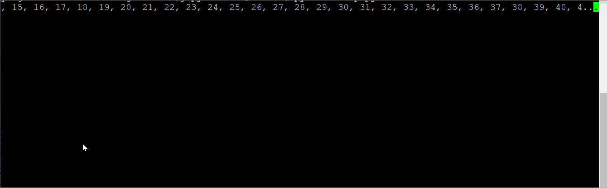

# TorchHelper
写的一个torch的帮助类，帮助使用者专注于训练逻辑，避免其他重复性劳动。建议有一定torch使用经验者用。

> 先定一个小目标：torch界的kears？

### introduction

#### install
```bash
pip install torchhelper
```
#### use
全部的代码位于[examples/normal.py](examples/templete.py)

import:
```python
# torchhelper will help import some torch modules
from torchhelper import *
 
from torchhelper.frame.callbacks import Traininfo, ModelCheckpoint,DebugCallback
```

Define your own module:
```python
class MyModel(nn.Module):
    def __init__(self,n_classes=10) -> None:
        super().__init__()
        self.n_classes = n_classes
        self.fc = nn.Linear(128, n_classes)

    def forward(self, x):
        out = x
        out = self.fc(out)
        return out
```

Define your own Trainer:
```python
class MyTrainer(Trainer):

    def __init__(self, param: TrainParam):
        super().__init__(param)

        self.regist_device() # default torch.device("cuda:0" if torch.cuda.is_available() else "cpu")

        self.model = MyModel(10)
        self.optim = optim.SGD(params=self.model.parameters(),
                                   lr=0.1,
                                   momentum=0.9,
                                   weight_decay=0.0001,
                                   nesterov=False)

        self.regist_model_and_optim({ #regist for saving model 
            "model":self.model,
            "optim":self.optim,
        })

        self.regist_dataloader(
            train=ToyDataLoader((10, 128), (10,)),#train
            eval=ToyDataLoader((10, 128), (10,)),#eval
            test=ToyDataLoader((10, 128), (10,)),#test
        )

        self.lossf = nn.CrossEntropyLoss()

    def train_batch(self, eidx, idx, global_step, data, device, param):
        meter = LogMeter()
        meter.epoch = "({}){}/{}".format(idx,eidx,param.epoch)

        model = self.model.to(device)
        optim = self.optim

        xs,ys = data
        xs,ys = xs.to(device),ys.to(device)
        logits = model(xs)

        meter.loss = self.lossf(logits,ys)

        optim.zero_grad()
        meter.loss.backward()
        optim.step()

        return meter

    def predict(self, xs): # 用于测试和验证
        return self.model(xs)
```

训练、验证、测试、日志输出一条龙
```python
if __name__ == '__main__':
    param = TrainParam() # You can alse extend this class(mainly for Auto-completion)
    param.epoch = 400

    param.build_exp_name(["epoch"],prefix="mymodel")
    trainer = MyTrainer(param)

    trainer.logger.line("Any log info will be handled by Trainer.logger")
    
    # Add log hook.
    logcall = Traininfo()
    logcall.auto_hook(trainer)
    
    # Add save hook.
    sv = ModelCheckpoint(base_dir="./project_path", 
                         monitor="loss",
                         max_to_keep=3,
                         mode="min")
    sv.auto_hook(trainer) # 根据callback类中有的on_xxx_begin()/_end()方法去寻找trainer中相应的方法绑定
    
    # 输出所有函数的执行流程的回调类，注意此时的调用方法为 reverse_hook（根据trainer有哪些方法，依次hook callback）
    # dbg = DebugCallback()
    # dbg.reverse_hook(trainer)
    
    # 如果要单独绑定trainer的某个方法，则通过以下方式：
    # trainer.add_callback(trainer.eval,callback=...)

    trainer.train()
```

## more feature

### 命令行参数解析支持
编辑文件 main.py
```python
from torchhelper import *

param = TrainParam()
print(param.logdict())

param = TrainParam().from_opt()
print(param.logdict())
```

运行命令：
```bash
python main.py --epoch=400 --softmax=5 --k=(1,2) --j={1:3}
```

输出：
```bash
OrderedDict([('global_step', 0), ('epoch', 5), ('eidx', 0), ('idx', 0), ('topk', '(1, 5)'), ('auto_device', '0.0000')])

OrderedDict([('global_step', 0), ('epoch', 400), ('eidx', 0), ('idx', 0), ('topk', '(1, 5)'), ('auto_device', '0.0000'), ('softmax', 5), ('k', (1, 2)), ('j', {1: 3})])

```
更多有关命令行参数的语法请参考[fire-guide](https://github.com/google/python-fire/blob/master/docs/guide.md)

### trainer中的部份变量逻辑
当不重写BaseTrainer中的方法时候，Trainer中的部份变量及其相应作用有：

- train_epoch_toggle = False：在当前iteration结束后是否提前结束当前epoch，该逻辑主要用于一些callback提前结束训练。在toggle触发一次后，会重新变为False。
- train_toggle = False：在当前epoch结束后是否体检结束当前训练，逻辑同上
- logger = Logger()：用于日志输出

### Callbacks
Callback是Trainer的回调函数，除了一些返回类型比较特殊的函数，大部分Trainer的函数以及自定义的函数都支持回调函数的绑定，并添加在函数执行前和函数执行后的处理逻辑。
```python
from torchhelper import *
cbk = ...
trainer = Trainer(...)
trainer.add_callback(trainer.train_epoch,cbk)
```
上面的代码实现了在`trainer.train_epoch()`方法执行前后，会分别调用`cbk.on_begin()`和`cbk.on_end()`方法，另外在一个回调类绑定到trainer的一个或多个方法的时候，会相应的执行`cbk.on_hooked()`和`cbk.on_first_hooked()`方法，如果调用方法失败（如该方法在trainer中禁止回调，或者不是函数，或者其他异常），那么会调用cbk.on_hook_failed方法。

如果在绑定的执行的过程中抛出了异常，那么会依次调用`cbk.on_exception()`方法
> 注意，因为函数的调用存在嵌套逻辑，所以如果同时处理多个回调函数，当发生异常的时候会递归抛出异常，因此在实现的回调函数中要注意判断当前发生异常的函数名称


#### AutoDevice
当显存溢出时，自动分配下一个GPU
```bash
2020-01-23 11:23:28 cuda:0 out of memory.
2020-01-23 11:23:28 Change to cuda:1
2020-01-23 11:23:29 cuda:1 out of memory.
2020-01-23 11:23:32 Change to cuda:2
2020-01-23 11:23:32 cuda:2 out of memory.
2020-01-23 11:23:38 Change to cuda:3
2020-01-23 11:23:38 cuda:3 out of memory.
2020-01-23 11:23:38 All devices out of memory.
```

#### Traininfo
用来输出训练过程中返回的信息，如果实现自己的train_batch()方法，则需要返回一个LogMeter()对象

#### ModelCheckpoint
用来自动监控LogMeter中的某个变量，从而自动保存更好的模型（类似于Keras中的这个类）

#### DebugCallback
用来输出所有方法的开始调用和结束调用的提示信息（即用来debug）


### ScreenStr
shorten text in one line:
```python
from torchhelper.base.structure import ScreenStr

for i in range(100000):
    print(ScreenStr("\r"+str(list(range(50)))),end="")
```




### 其他
#### Branch：静态图模型
Branch是一个模仿自TensorFlow的静态图逻辑，用于控制函数执行流程的类，可以用来灵活的在复杂逻辑中控制只执行部份函数得到部份结果。

下面的例子用来掩饰在一个小的加法和乘法逻辑中，如果只要加或者乘的函数被执行，所需要执行的步骤

代码并不是很pythonic，虽然有一些自认为巧妙的构造，简化了代码逻辑，但实际上并不易懂。

```python
def add(a, b):
    print("add")
    return a + b

def multi(a, b):
    print("multi")
    return a * b

def swap(a, b):
    print("swap")
    return b, a

p = PseudoVar()
br = Branch()

br.add_node = add, (p.a, p.b), (p.c) # equal to add, br(by = (p.a,p.b),to = (p.c), force_dis=False,replace=None)
br.multi = multi, (p.a, p.c), (p.d)
br.swap = swap, (p.a, p.b), (p.sa, p.sb)
res = br.run_for(p.d, p.sa, a=1, b=2)

print(res,type(res))
print(res.d)

# or
br.add_needs(p.d,p.sa)
br.run(a=1,b=2)

# 如果不用该函数，那么执行逻辑会变成类似下面的
# 代码行数并没有少或者多太多
# 但是如果该执行逻辑很复杂，需要很多个if语句来重复判断某个arg时，上面的branch方式就会很方便的自动执行流程
cacu_add = True
cacu_multi = True

c = 0
if cacu_add:
    c = add(a,b)

if cacu_multi:
    d = multi(a,c)
```

## todos
- 解除回调类绑定
- 更多方便正确率和loss计算的代码（等我试验用到了再加）
- 认真研究一下版本号规范一下+修正包的开发状态声明（？
- 修复可能存在的bug？
- 完善可能需要的document？
- 添加tensorboard控制逻辑（等我试验用到了再加）